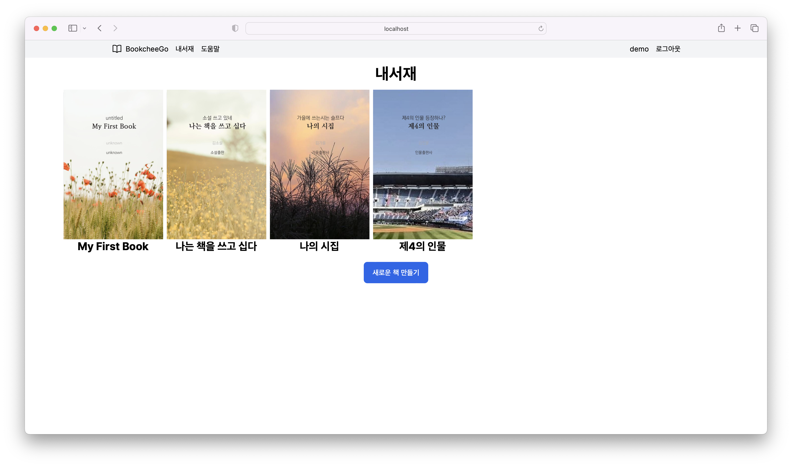

나의 책 페이지에는 그동안 내가 작성한 책들을 수정 할 수 있다.

여러 개의 책의 모양 중 작업을 할 책을 클릭 하면 책의 내용으로 들어간다.

내 서재 페이지에서는 '새로운 책 만들기' 버튼을 눌러서 새로운 책을 만들 수도 있고,
[[2.2 새로운 책 만들기]]

내가 만든 책 각각의 표지를 클릭해서 내용을 수정할 수도 있다.
[[2.3 선택한 책]]
