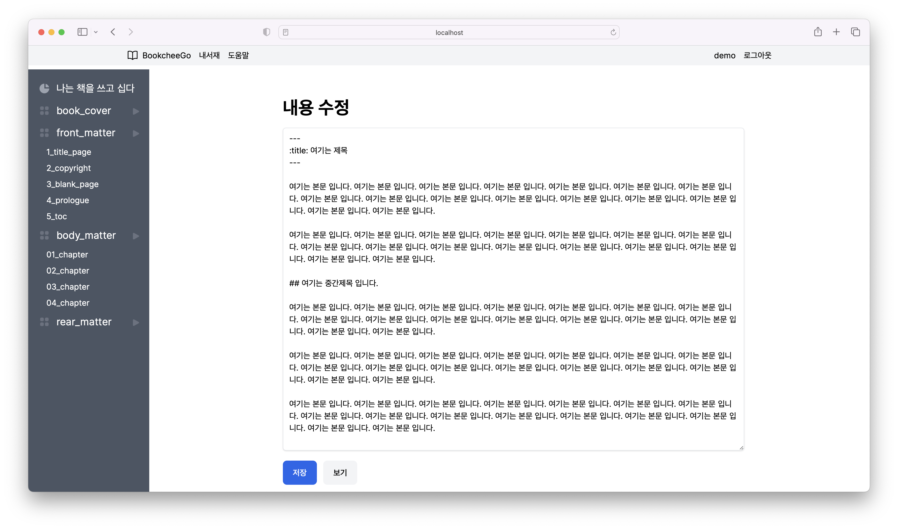

## 마크다운 문법을 사용해서 문서 작성 하기

모든 도큐멘트는 마크다운(.md) 문법으로 작성되고 저장된다.


>한국 위키피디아 - 마크다운에 대한 설명
>
> https://ko.wikipedia.org/wiki/%EB%A7%88%ED%81%AC%EB%8B%A4%EC%9A%B4



마크다운 에서 제목 부분은 6개의 단위로 제목으로 표시할 수 있다.
대제목부터 소제목까지 단계별로 제목을 표시할 수 있다.


```
#, ##, ###, ####, #####, ######
```


### 마크다운 머리 부분의 metadata 영역

마크다운 입력 시 머릿부분에 특수한 정보를 입력할 수 있는 부분을 metadata 영역이라고 한다.
여기에는 본문 내용과 별도로 여러가지 도큐멘트에 대한 정보를  입력할 수 있는 부분이다.

```
제목: 먹고 사는 방법
tag: 음식에 관한 글
```

###  본문 입력

마크다운에서  본문을 입력할때 단락과 단락 사이를 구분하려면 추가로 빈 줄을 입력 해야 한다.
빈줄이 없이 줄바꾸기만 하면 동일한 단락으로 취급해서 우리가 워드 프로세서에서 사용하던 것과 다른 모양으로 출력된다. 반드시 새로운 단락을 시작 할 때 빈줄을 추가해야 한다.
빈줄이 여러 개 있는 경우 빈줄은 무시된다. 

### 강조 (볼드체)

**볼드체**로 쓰고 싶은 내용이 있다면

```
아래와 같이 해당 내용의 앞과 뒤에 별 두 개(**)를 붙인다.

**볼드체로 쓰기**
```

###  이탤릭

*이탤릭체* 로 쓰고 싶은 내용이 있다면

```
아래와 같이 해당 내용의 앞과 뒤에 별 한 개(*)를 붙인다.

*이탤릭체로 쓰기*
```


### 인용문(blockquote)

인용문으로 쓰고 싶은 내용이 있다면

```
아래와 같이 내용의 각 줄 앞에 '>' 기호를 붙인다.

> 이것은 인용문입니다.
>
> 이것은 인용문입니다.
```

> 이것은 인용문입니다.
>
> 이것은 인용문입니다.


### 주석(footnote)

주석으로 쓰고 싶은 내용이 있다면

```

주석 달기는[^1] 이렇게 표시하고 아래와 같이 한줄 띄고 주석 설명을 입력 한다.

[^1]: 여기는 주석 1에 대한 설명 입니다.

```


